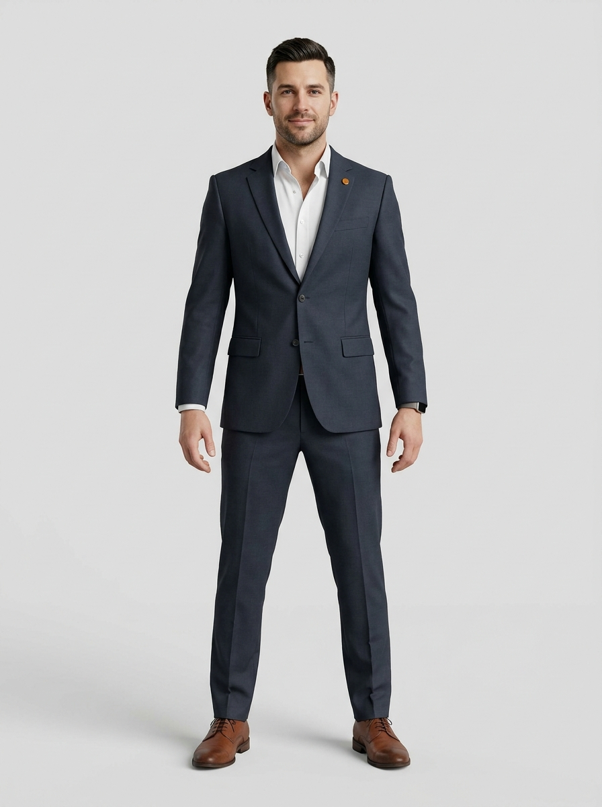
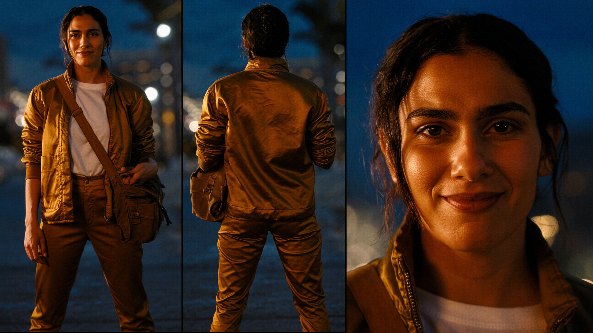

# Reality — Character Bible

## THE game character — "Citizen One" (walks the streets)

The in-world playable character: a professional man in his early 30s — tailored
charcoal-navy suit, white open collar, **amber-gold lapel pin** (the brand mark),
brown derby shoes. Designed to production standard for street-level play:

- **Rig-ready A-pose turnaround**: `assets/characters/citizen-one/{front,side,back}.png`
  (identity-locked across views, neutral seamless background)
- **Animated 3D model**: `assets/characters/citizen-one/citizen-one.glb` —
  textured, rigged, bound to the `Confident_Walk` clip (Higgsfield
  `multi_image_to_3d` from all three views + rigging + animation, 38 credits)
- Style: stylized-realistic 3D game render (not photo) so he sits naturally
  on the map at street zoom
- Provenance job IDs: front `5026844d-852d-472a-a2d0-af7ca6341161`,
  side `fd26b5b4-b82a-42fe-bf4f-84723ad2a871`, back `6802cd6b-e63b-405b-9128-fb5336aa98fd`,
  3D `a8e0e796-d76a-487f-8016-74308dd78513`

New in-world characters (outfits, future NPCs) must follow this exact pipeline:
front A-pose → identity-locked side + back → `multi_image_to_3d` with texture,
rigging, and a library animation clip.

Every character in Reality is generated to one standard, established by Character #001.
This document is the canon: who exists, what they look like, and the exact recipe for
casting the next one.

## Character #000 — Dan, The Architect

**The founder.** Before the first citizen claimed a slot, someone had to build the
planet. Dan stands in the mission-control room at night, arms crossed, the Earth
burning gold behind him — the world he's handing over to 2,000 founders. Canon:
`assets/characters/architect-v2.png` (editorial alternate: `architect-v1.png`).

**Visual canon**: rectangular glasses, short spiked dark hair, groomed short beard,
charcoal hoodie under dark jacket, **amber-gold globe pin** (his one gold item),
Earth-at-night screen backdrop, warm amber rim + cool blue fill.

**Provenance**: Nano Banana Pro (identity-referenced from Dan's real portraits),
3:4, ~2 credits/run.
- Reference media_ids: `eb2a1c23-8194-403f-a68d-201d9996f441`, `640cf46b-d875-4dca-b8b0-06f74a07c72f`
- Job IDs: v1 `d0f4eca3-8ad1-44df-aba1-c4a334b20dc9` · v2 (canon) `d2e42fba-3cb6-47ed-b0a5-5ca5f459a848`

## Character #001 — Maya Reyes

**The First Citizen.** Maya is the face of Reality: a 27-year-old courier of
Filipino-Brazilian heritage, photographed at dusk on her first day in a new world.
She is what every player is at minute one — broke, capable, and quietly certain
she'll own something someday. Canon variant: `assets/characters/maya-v1.png`
(alternate cinematic take: `maya-v2.png`).

**Visual canon**
- Warm brown skin, natural texture, no retouching
- Dark hair loosely tied back, escaped strands
- Amber-gold courier bomber over plain white tee, canvas messenger bag
- Night-city bokeh: warm golden windows against deep blue dusk
- Amber key light one side, cool blue fill the other
- Expression: slightly tired, genuinely hopeful half-smile, direct gaze

**Provenance** (for regenerating or extending her)
- Model: Higgsfield `soul_cast`, budget 300, 16:9, ~1 credit per sheet
- Job IDs (reusable as reference inputs for image→video or new scenes):
  - v1 (canon): `b9bc25c3-edb6-4536-9d31-3693552dbfc7`
  - v2 (cinematic): `fc3c486a-1764-4e5b-b7b0-16ccf00fb5e1`

## The template — how every Reality character is made

1. **Model**: Higgsfield `soul_cast` (character turnaround: front / back / close-up
   in one 16:9 sheet), `budget: 300`.
2. **Person first, archetype second.** Every character is a real-feeling human at a
   point on the game's arc (courier → shop owner → mogul). Write their one-line
   backstory before the prompt.
3. **Realism rules** (verbatim in every prompt): *natural skin texture and visible
   pores, unretouched documentary realism, 85mm lens, f/1.8, eye level, tack-sharp
   focus on the eyes, cinematic color grade.*
4. **Palette lock**: night-city or dawn-city backdrop; warm amber key + cool blue
   fill — the game's Earth-at-night colors. One amber-gold wardrobe item per
   character, always.
5. **Wardrobe = career.** Dress them for a job in `src/game/catalog.ts` (courier,
   barista, developer, hotel owner…). Their outfit should tell you their level.
6. **Cast the world.** Characters span every continent, age 18–75, all builds.
   No two characters share heritage + age bracket until the roster is genuinely global.
7. **Files**: save the sheet to `assets/characters/<name>-v<N>.png`, record job IDs
   and canon here, in this file.

## Prompt template

> Photorealistic cinematic portrait of {NAME}, a {AGE}-year-old {HERITAGE} {ROLE} —
> {ONE-LINE STORY}. {SKIN/HAIR/EYES with natural texture and visible pores},
> {EXPRESSION}. They wear {CAREER WARDROBE} with {ONE AMBER-GOLD ITEM}.
> Behind them, {NIGHT/DAWN CITY SCENE} as soft bokeh. Warm amber rim light on one
> side of the face, cool blue fill on the other. 85mm lens, f/1.8, eye level,
> tack-sharp focus on the eyes, unretouched documentary realism, cinematic color grade.

## Next steps for Maya

- **Train a reusable Soul identity** (needs 5+ reference images — generate 2–3 more
  sheets, then `show_characters action=train`) so Maya stays pixel-consistent across
  future stills, ads, and video.
- Her job IDs can seed image→video (Seedance/Kling) for the launch TikTok clip.

## The Guide — the living state character (HUD, right side)

Reality's mascot-grade companion (from Dan's reference sheet: navy/orange
hooded jersey #7, Pixar-style 3D). He IS the simulation:

- **Four mood states** driven by `moodOf()` every tick: happy-and-energetic
  (his target), hungry (also thirst), tired, upset (pain or joylessness).
  Art: `public/character/t1-{mood}.png`, identity-locked generations from the
  reference (nano banana pro; jobs c38b6c78/13948d1f/61c1f1ba/7d6472d6;
  reference media 3d22499b, archived at assets/characters/state-character-ref.jpg).
- **He guides**: `adviceOf()` (engine, test-locked ladder) gives one first-person
  line + one CTA — survival → collect → job → home → business → fun → expand.
- **Achievement tiers** change his look via `tierOf()`: t1 starter (shipped),
  t2 established (level 5+ / first business), t3 mogul (5 businesses / $1M) —
  t2/t3 art pending, falls back to t1 automatically.
